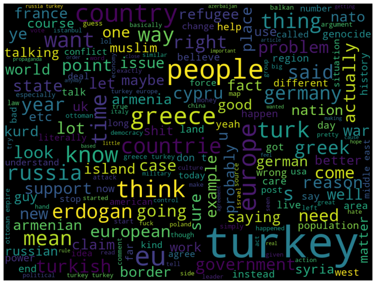
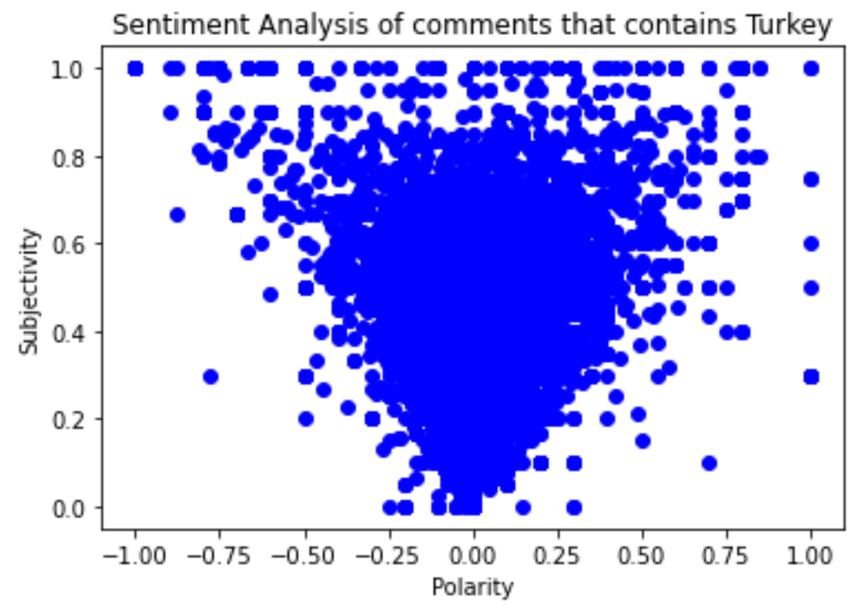
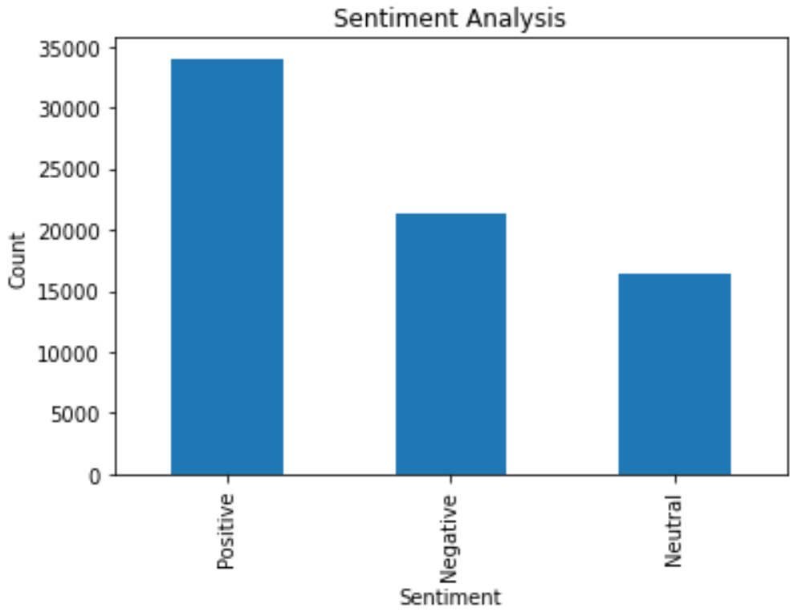

= About the project

* This project aims to have a better understanding of the general opinion about Turkey in the r/europe subreddit by performing sentiment analysis on comments crawled from related subreddit.

* This serves as the final project for BTM553 Advanced Techniques in Text Processing and Analysis.

== The dataset

* Crawled from r/europe subreddit.

* Contains a total of 71820 comments between December 2017 - December 2020.

* All of the comments contain the word 'Turkey' (case insensitive).

* Labeled as three categories for sentiment analysis which are positive, negative, and neutral.

== Data pre-processing

* Stop-words removed using Gensim.

* Hyperlinks, emojis, special characters, and excess new lines were removed using regular expressions.

* Word cloud were created for the dataset.

=== Data annotation

* The dataset is annotated using TextBlob.

* Two features are the main features for sentiment analysis with TextBlob:

** **Subjectivity:** It gives numerical information about how subjective the text is. As it goes above 0, the text contains more subjective expressions.

** **Polarity:** Provides numerical information about how positive or negative the text is. While 0 represents neutral for most data sets, values above 0 indicate a positive interpretation and values below a negative interpretation.

* Using the polarity value, the texts were labeled in three different categories as positive, negative and neutral.

* The scatter plot of the *polarity* and *subjectivity* values of ten percent of the data set *(7182 comments)* is given.

* As can be seen in figure, there is an accumulation in the range of [-0.25, 0.25] for the polarity value. In addition, the subjectivity of the interpretation increases or decreases the polarity.

* There are 34026 positive (47.4%), 21331 negative (29.7%) and 16463 neutral (22.9%) comments.

* The preprocessed dataset is saved as *preprocessed_european_comments.csv* for the future use of machine learning applications.
